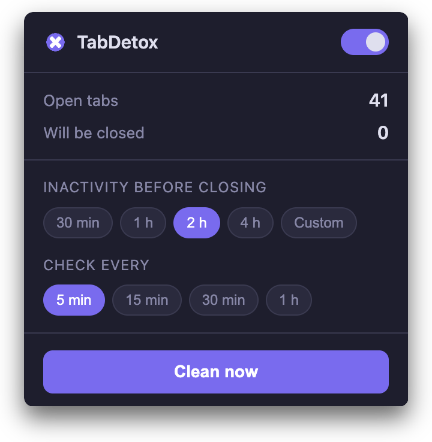

# TabDetox

  

TabDetox is a Chrome extension that helps you keep a calm tab bar.

It watches inactive tabs, saves them to bookmarks, and closes them for you.

## Why people use it

Many people keep too many tabs open because they want to read something later.

After some time, the browser becomes hard to read. Important tabs get lost in the middle of old ones.

TabDetox solves this in a simple way. Old tabs leave your tab bar, but they are not lost. They are saved in bookmarks first.

## What it does

- Closes inactive tabs automatically
- Saves each closed tab to bookmarks before closing it
- Keeps active tabs and pinned tabs safe
- Lets you choose when a tab becomes inactive
- Lets you choose how often the check runs
- Gives you a `Clean now` button for a manual refresh
- Stores saved tabs in clear folders by date
- Removes old saved folders after one week
- Works in English and French

## A simple control panel

The popup is made to be clear in a few seconds.

You can see how many tabs are open, how many tabs may be closed, and when the last cleanup happened. You can also turn the extension on or off at any time.

## How it works

1. You open tabs during the day.
2. TabDetox checks which tabs have been inactive for too long.
3. It saves those tabs to bookmarks, inside a dated folder, and closes them.

This means your browser stays lighter, but your pages are still easy to find later.

## Built for normal browsing

TabDetox is made for people who want less noise, not more settings.

It does not try to replace your bookmarks, your reading list, or your browser. It only helps you remove old tabs in a safe and quiet way.

## Privacy

TabDetox works inside your browser.

It does not need an account. It does not send your tabs to an external server. Your cleanup history stays in your browser through bookmarks and local extension storage.

## License

This project is available under the MIT License. See `LICENSE`.
